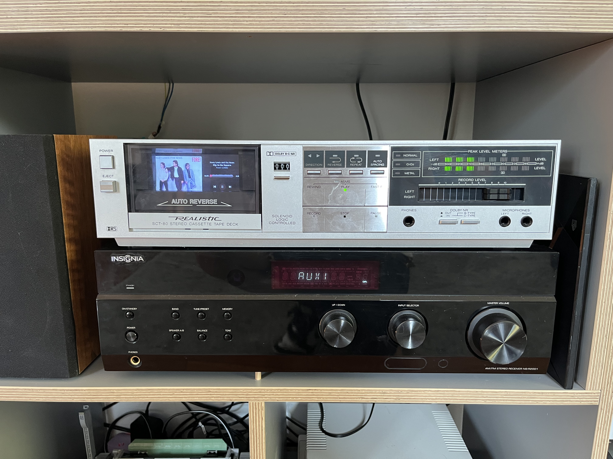
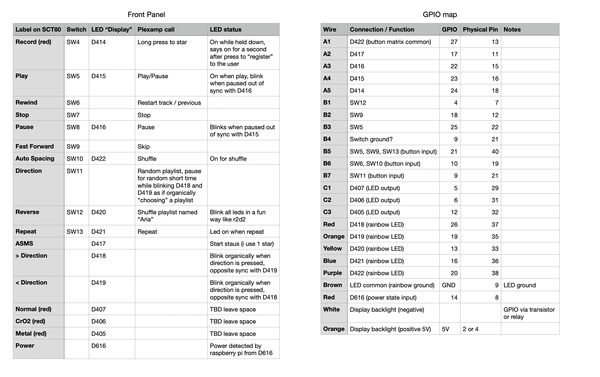
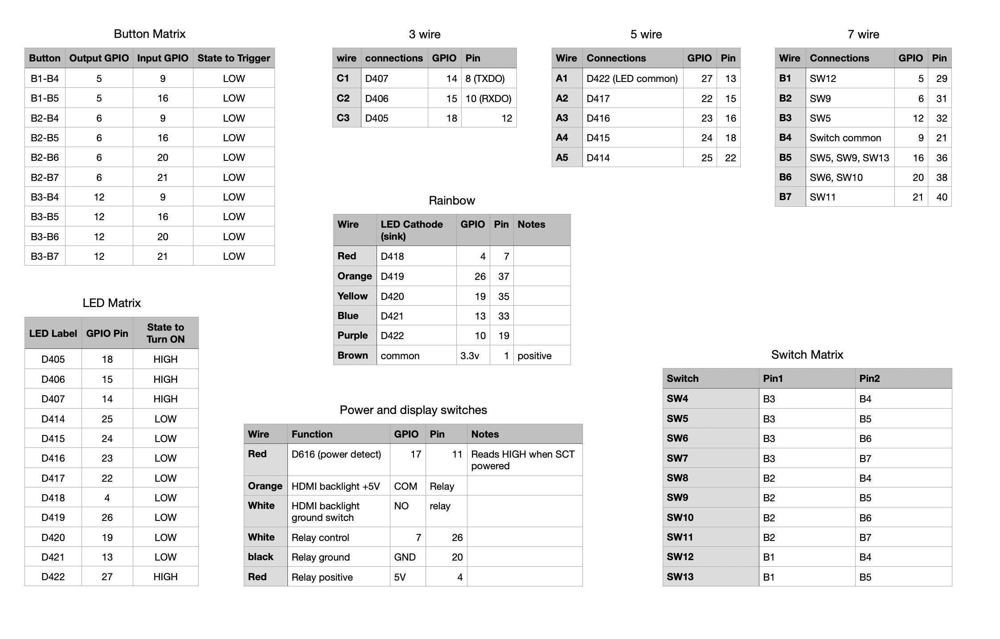
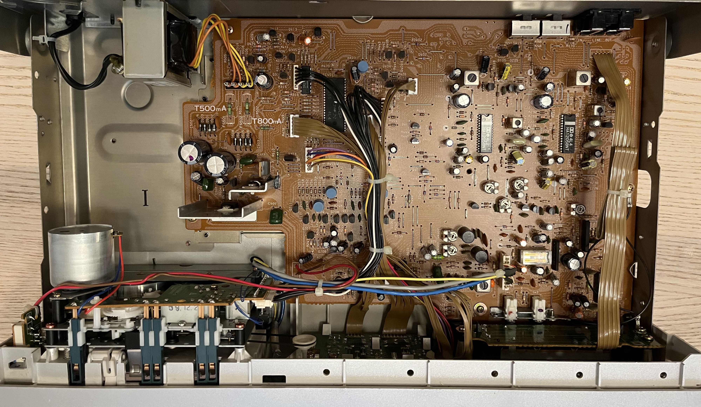
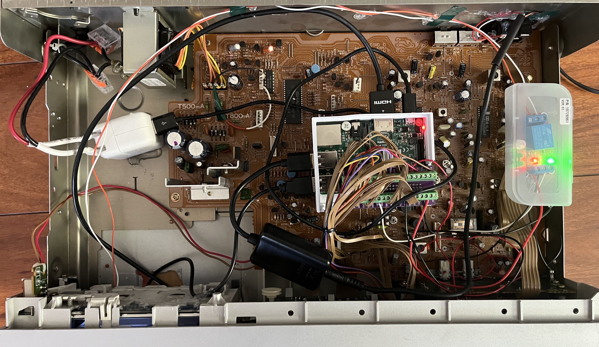

# 🎛️ SCT-80 Vintage Tape Deck Plexamp Build

This project transforms a 1980s **Realistic SCT‑80 stereo cassette deck** into a fully modern streaming music player powered by a Raspberry Pi running [Plexamp Headless](https://plexamp.com). It retains the original front‑panel controls, LEDs, and overall vintage look, while replacing the tape mechanism with digital audio hardware and smart GPIO control. The result is an analog‑era design with digital convenience.

In addition to basic playback, the build integrates LED feedback, a relay‑controlled display, and custom scripts that allow the original buttons to control Plexamp over its local API for near‑instant responsiveness.



---

## 🛠️ What It Does

- **Raspberry Pi 3** embedded in the tape deck
- Runs **Plexamp in headless mode** (via `odinb` install)
- All original front panel **buttons and LEDs repurposed** through GPIO
- **USB DAC** feeds audio through the original RCA jacks
- **4” HDMI display** replaces the tape window, shows album art and playback info
- Physical **button controls** for Play, Stop, Next, etc.
- LED feedback for **playback status**
- **Relay-based screen power** (screen only turns on when the deck is powered)
- Entire system mounts inside the original SCT-80 chassis

- Reads playback state and metadata directly from Plexamp's **local port (localhost)** for faster updates and reduced dependency on the Plex Media Server

---

## 🧠 Control Mapping and GPIO Reference

These charts show how the original SCT-80 buttons, LEDs, and display wiring were mapped to the Raspberry Pi GPIO:

### Front Panel Mapping


### Switch and LED Matrix Details


---

## 📸 Build Photos

| Original Interior | Pi + GPIO Installed | Final Look |
|------------------|----------------------|------------|
|  |  |  |

---

## 📁 Folder Structure

```plaintext
├── config/
│   └── user_settings.json
├── images/
│   ├── IMG_6209.jpeg
│   ├── IMG_6398.jpeg
│   └── IMG_6402.jpeg
├── shared/
│   └── temp.json
├── user_scripts/
│   ├── backlight_test.py
│   ├── button_matrix_test.py
│   ├── end_pointer.py
│   ├── led_tester.py
│   ├── play_button_test.py
│   └── status_test.py
├── actions.py
├── button_config.py
├── env.example          # Safe placeholder for .env
├── gpio_config.py
├── led_control.py
├── main.py              # Starts GPIO listeners and state loop
├── plexamp_api.py       # Unofficial Plexamp Web API controller
├── README.md
└── state_manager.py
```

---

## 🚀 Features in Detail

- **Local API Integration** – All real‑time LED updates and button actions use Plexamp’s local `/player/timeline/poll` endpoint, minimizing network latency and avoiding unnecessary server calls.
- **Physical Controls** – Every button from the SCT‑80 has been mapped via a GPIO switch matrix. Actions include Play/Pause, Next/Previous track, Star (rating), Repeat, Shuffle (future), Random Album Radio, and power‑controlled display backlight.
- **LED Feedback** – Original LED indicators light or blink based on player state (e.g., Play LED on when playing, Pause LED blinking when paused). Additional LEDs are available for genre/mood or other metadata.
- **Relay‑Based Display Control** – The HDMI display behind the cassette window powers on only when the SCT‑80’s physical power switch is engaged.
- **Easy Extensibility** – Actions and LED mappings are driven by `button_config.py` and `led_control.py`, making it simple to change behaviors without rewiring.
- **Headless Operation** – The Raspberry Pi runs Plexamp in headless mode via the `odinb` install method, outputting audio through a USB DAC to the original RCA connectors.

---

## ⚙️ Setup & Configuration

1. **Hardware Prep**
   - Remove the tape mechanism and mount the Raspberry Pi 3 inside the SCT‑80 chassis.
   - Connect button and LED wiring to the Pi via GPIO according to `gpio_config.py`.
   - Install a relay module for the display backlight, wired to the SCT‑80’s power switch and Pi control pin.

2. **Software Installation**
   - Install Raspberry Pi OS Lite (64‑bit recommended).
   - Install Plexamp Headless using [odinb’s guide](https://howtohifi.com/how-to-create-a-headless-plexamp-player-using-odinbs-plexamp-installer-script/).
   - Clone this repository to the Pi.

3. **Environment Variables**
   - Copy `env.example` to `.env` and set:
     ```
     PLEXAMP_PORT=32500
     PLEXAMP_TOKEN=your_plexamp_token
     PLEXAMP_PLAYER=your_player_id
     PLEX_SERVER=your_plex_server_ip
     PLEX_PORT=32400
     ```
   - `PLEX_SERVER` and `PLEX_PORT` are only used for rating (star) actions; all other commands use `localhost`.

4. **Run the Controller**
   ```
   nohup python3 main.py &
   ```
   This will start GPIO scanning and LED state updates in the background.

---

## 🧪 Testing

Test scripts are available in `user_scripts/`:
- `led_tester.py` – Cycle through LEDs to verify wiring.
- `button_matrix_test.py` – Detect button presses in the switch matrix.
- `status_test.py` – Query Plexamp’s local timeline and display playback state.

---

## 📌 Notes

- This build assumes the SCT‑80’s LEDs are wired as per the documented matrix; if yours differs, adjust `LED_PINS` and `LED_COMMON` in `gpio_config.py`.
- The `star` function uses the local API to get the current track’s `ratingKey` and then calls the Plex Media Server only to submit the rating.
- Repeat and Shuffle actions are placeholders until Plexamp exposes them in the local API.
# SCT-80 Vintage Tape Deck Plexamp Build

This project converts a 1980s Realistic SCT-80 cassette deck into a modern streaming player using a Raspberry Pi running Plexamp Headless. The goal is to keep the original look and front-panel controls while replacing the tape mechanism with digital audio and GPIO control. Buttons and LEDs work like they did on the deck, but now drive Plexamp over its local API.

The build adds LED feedback, a relay-controlled display behind the cassette window, and simple Python scripts to translate button presses into Plexamp actions. State and metadata are read from the local Plexamp port for quick updates without depending on the Plex Media Server.

---

## What it does

- Raspberry Pi 3 installed in the SCT-80 chassis
- Plexamp running in headless mode (installed via odinb guide)
- Original front-panel buttons and LEDs repurposed over GPIO
- USB DAC to the deck’s original RCA outputs
- 4" HDMI display behind the cassette window showing album art and status
- Physical buttons for play/pause, next/previous, star, repeat (placeholder), shuffle (placeholder), random album radio, and display backlight control
- LED feedback for player state
- Display backlight powered through a relay tied to the deck’s power switch
- Playback state and metadata read from Plexamp’s local port (localhost) to reduce latency

---

## Control mapping and GPIO reference

These diagrams show how the SCT-80 front panel maps to Raspberry Pi GPIO:

- Front panel mapping: `images/front_GPIO.png`
- Switch and LED matrix: `images/wires_buttons_leds.png`

Build photos are in `images/` (before, wiring, final).

---

## Folder structure

```plaintext
├── config/
│   └── user_settings.json
├── images/
│   ├── IMG_6209.jpeg
│   ├── IMG_6398.jpeg
│   └── IMG_6402.jpeg
├── shared/
│   └── temp.json
├── user_scripts/
│   ├── backlight_test.py
│   ├── button_matrix_test.py
│   ├── end_pointer.py
│   ├── led_tester.py
│   ├── play_button_test.py
│   └── status_test.py
├── actions.py
├── button_config.py
├── env.example          # template for .env
├── gpio_config.py
├── led_control.py
├── main.py              # starts GPIO listeners and state loop
├── plexamp_api.py       # local Plexamp API controller
├── README.md
└── state_manager.py
```

---

## How it works (details)

- Local API integration: real-time state and metadata come from the Plexamp local endpoint `/player/timeline/poll`, which avoids server delays.
- Physical controls: each original button is mapped via a switch matrix. Actions include play/pause, next/previous, star (rating), random album radio, repeat/shuffle placeholders, and backlight toggle.
- LED feedback: original LEDs indicate player state (for example, Play LED on when playing; Pause LED on when paused/stopped). Extra LEDs can be tied to metadata such as genre or mood.
- Display control: the HDMI display powers on only when the deck’s power switch is on, via a relay.
- Extensibility: actions and LED mappings are configured in `button_config.py` and `led_control.py`.

---

## Setup and configuration

1. Hardware
   - Remove the tape mechanism and mount the Raspberry Pi in the SCT-80.
   - Wire the button and LED matrix to GPIO as defined in `gpio_config.py`.
   - Add a relay for the display backlight and connect it to the deck’s power switch and a Pi control pin.

2. Software
   - Install Raspberry Pi OS Lite (64-bit recommended).
   - Install Plexamp Headless using odinb’s guide.
   - Clone this repository to the Pi.

3. Environment variables
   - Copy `env.example` to `.env` and set:
     ```
     PLEXAMP_PORT=32500
     PLEXAMP_TOKEN=your_plexamp_token
     PLEXAMP_PLAYER=your_player_id
     PLEX_SERVER=your_plex_server_ip
     PLEX_PORT=32400
     ```
   - The server values are only used for submitting ratings. All other calls use `localhost`.

4. Run the controller
   ```bash
   nohup python3 main.py &
   ```
   This starts GPIO scanning and LED updates in the background.

---

## Testing

Available in `user_scripts/`:
- `led_tester.py` — verify LED wiring
- `button_matrix_test.py` — check switch matrix input
- `status_test.py` — read player state via the local timeline endpoint

---

## Notes

- If your LED matrix wiring differs from the diagrams, adjust `LED_PINS` and `LED_COMMON` in `gpio_config.py`.
- The `star` function reads the current item’s `ratingKey` from the local poll and then sends a single request to the Plex Media Server to submit the rating.
- Repeat and shuffle are placeholders until Plexamp exposes those controls in the local API.